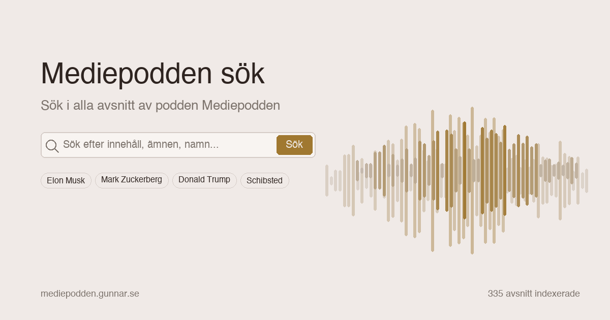

# Mediepodden Search

Full-text search engine for [Mediepodden](https://www.patreon.com/mediepodden), a Swedish podcast about media, tech, and digital culture hosted by Emanuel Karlsten and Olle Lidbom.

Search across all transcribed episodes with live results, audio clip playback, and waveform visualization.

**Live at [mediepodden.gunnar.se](https://mediepodden.gunnar.se)**



## Features

- **Full-text search** across all transcribed episodes using SQLite FTS5
- **Live search** with instant results via HTMX (300ms debounce)
- **Audio clips** — listen to search results with fade in/out and waveform display
- **Timeline visualization** — see how often a topic appears across episodes
- **Entity statistics** — browse people, companies, platforms, and events mentioned in the podcast
- **Episode browser** — list all episodes with transcription export (SRT/TXT)
- **Admin panel** — import episodes from RSS, trigger cloud transcription, monitor progress
- **Dark/light theme** with system preference detection
- **Shareable clips** — each search result has a permalink with Open Graph image and audio
- **SEO** — sitemap, robots.txt, structured data (JSON-LD), canonical URLs

## Tech Stack

| Layer | Technology |
|-------|-----------|
| Framework | [FastAPI](https://fastapi.tiangolo.com/) (async Python) |
| Database | SQLite (WAL mode) + [aiosqlite](https://github.com/omnilib/aiosqlite) + FTS5 |
| Frontend | [Jinja2](https://jinja.palletsprojects.com/) + [HTMX](https://htmx.org/) + vanilla CSS |
| Transcription | [svenska-ord](https://github.com/gunnarr/svenska-ord) (cloud) / [mlx-whisper](https://github.com/ml-explore/mlx-examples) (local) |
| Audio | ffmpeg (clip generation with padding and fade) |
| Storage | AWS S3 (episode audio), local cache (clips, OG images) |
| Entity extraction | Claude API (Haiku) |
| CI/CD | GitHub Actions (test → deploy → healthcheck → smoke test) |

## Getting Started

### Prerequisites

- Python 3.12+
- ffmpeg (for audio clip generation)
- SQLite 3.35+ (for FTS5 support)

### Setup

```bash
# Clone
git clone https://github.com/gunnarr/mediepodden.git
cd mediepodden

# Environment
cp .env.example .env
# Edit .env with your settings

# Install
python -m venv .venv
source .venv/bin/activate
pip install -r requirements.txt

# Run
uvicorn app.main:app --reload
```

The app starts at [http://localhost:8000](http://localhost:8000).

### Adding Episodes

**Via admin panel** (recommended):

1. Go to `/admin` (set `ADMIN_PASSWORD` in `.env`)
2. Paste an RSS feed URL → "Hämta"
3. Select episodes → "Transkribera valda"
4. Progress updates live via HTMX polling

**Via CLI** (local transcription):

```bash
# Place MP3 files in IN/
cp "Mediepodden 175 - Title.mp3" IN/

# Transcribe (requires mlx-whisper + Apple Silicon for GPU acceleration)
python scripts/transcribe.py

# Or use cloud transcription (requires svenska-ord)
python scripts/transcribe.py --cloud
```

## Project Structure

```
app/
├── main.py                    # FastAPI app, middleware, health endpoint
├── config.py                  # Environment configuration
├── database/                  # SQLite schema, migrations, queries
│   ├── connection.py          # DB connection, slugify
│   ├── schema.py              # Schema, migrations, init
│   ├── episodes.py            # Episode CRUD + segments
│   ├── search.py              # Full-text search + timeline
│   ├── analytics.py           # Page views, search logs, stats cache
│   └── settings.py            # Key-value settings store
├── routers/
│   ├── search.py              # / (search), /sok (HTMX), /statistik, /om
│   ├── episodes.py            # /avsnitt (list + detail), exports (.srt/.txt)
│   ├── clips.py               # /klipp (audio, waveform, OG images)
│   ├── admin.py               # /admin (feed import, transcription)
│   └── seo.py                 # robots.txt, sitemap.xml
├── services/
│   ├── audio.py               # Clip generation, waveform data (ffmpeg)
│   ├── s3.py                  # S3 upload/download/exists
│   ├── feed.py                # RSS parsing, episode number extraction
│   ├── feed_monitor.py        # Nightly RSS check + auto-transcription
│   ├── transcription.py       # Job queue, background worker
│   └── entities.py            # Named entity extraction (Claude API)
├── templates/                 # Jinja2 HTML templates
└── static/                    # CSS, favicon, OG images
scripts/
├── transcribe.py              # CLI transcription (local mlx-whisper or cloud)
├── transcribe-all.sh          # Batch transcription wrapper
├── extract_entities.py        # Batch entity extraction
└── generate_og_image.py       # Generate static OG image
tests/                         # pytest test suite
```

## Search

The search engine uses SQLite FTS5 with `unicode61` tokenization for Swedish text. Search results include:

- Highlighted matching text with surrounding context
- Audio clip playback with waveform visualization
- Timeline showing hit distribution across episodes
- Filters: speaker, episode range, sort order (relevance/newest/oldest)
- Pagination (50 results per page)

## Transcription

Two transcription backends are supported:

| Backend | Platform | Speed | Setup |
|---------|----------|-------|-------|
| mlx-whisper (KBLab/kb-whisper-large) | Apple Silicon | ~7.5x realtime | Local MLX model |
| svenska-ord (Modal GPU) | Any (cloud) | ~18x realtime | Modal account |

Both use KBLab's Swedish Whisper model. Speaker diarization is available locally via pyannote.audio.

## Nightly Feed Monitor

When an RSS feed URL is saved in the admin panel, the app automatically:

1. Checks the feed daily at a configurable hour (default: 03:00)
2. Creates new episodes and starts cloud transcription
3. Retries previously failed episodes
4. Auto-assigns episode numbers when missing from the feed
5. Extracts named entities after transcription completes

## Environment Variables

See [`.env.example`](.env.example) for all available settings. Key variables:

| Variable | Description |
|----------|-------------|
| `ADMIN_PASSWORD` | Password for `/admin` (leave empty to disable) |
| `DATABASE_PATH` | SQLite database path |
| `AUDIO_DIR` | Local audio directory |
| `S3_AUDIO_BUCKET` | S3 bucket for episode audio (leave empty for local only) |
| `FEED_CHECK_HOUR` | Hour (0-23) for nightly RSS feed check |
| `ANTHROPIC_API_KEY` | Claude API key for entity extraction |
| `HUGGINGFACE_TOKEN` | HuggingFace token for speaker diarization |

## Tests

```bash
# Run all tests
pytest

# Run with verbose output
pytest -v

# Run specific test file
pytest tests/test_search.py
```

The test suite covers database operations, search, API routes, admin validation, feed parsing, OG tags, and SEO.

## CI/CD

Pushes to `main` trigger a GitHub Actions pipeline:

1. **Test** — install dependencies, run full test suite
2. **Deploy** — rsync to production server, install deps, restart service
3. **Healthcheck** — verify `/health` endpoint responds
4. **Smoke test** — verify search returns HTTP 200

## License

This project is the source code for [mediepodden.gunnar.se](https://mediepodden.gunnar.se). You're welcome to read and learn from it, but please don't deploy copies of it — the content is specific to Mediepodden.

## Credits

Built by [Gunnar R Johansson](https://gunnar.se).

Mediepodden is a podcast by Olle Lidbom and Emanuel Karlsten. [Listen on Patreon](https://www.patreon.com/mediepodden).

Transcription powered by [KBLab/kb-whisper-large](https://huggingface.co/KBLab/kb-whisper-large).
